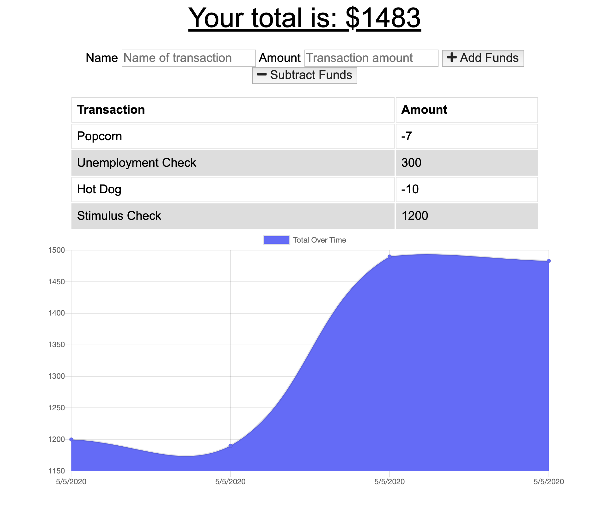
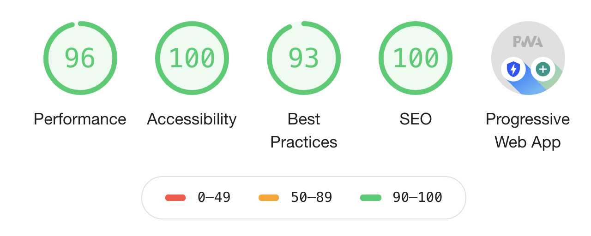

# PWA Budget Tracker 
 #### [Demo](https://pwa-bdgt-tracker.herokuapp.com/)


## Description

This is a simple budget tracking application that lets users add funds and subtract expenses. The main purpose of the app is to 
showcase an example of a Progressive Web App with data persistence. What this means is that this app can be downloaded as an application
that can work outside the browser. It also can keep saving user data locally using the indexedDB browser API when the app is offline, and
sync it back up to the MongoDB database when coming back online. This is all possible by creating a service worker script.

 
      

## Technologies

- [Node.js](https://nodejs.org/en/) 
- [Express](https://expressjs.com/) 
- [MongoDB](https://www.mongodb.com/)
- [Mongoose](https://mongoosejs.com/)

## Usage and Installation

Feel free to clone or fork this repo if you find it useful. To install dependencies make sure to run:

```
npm i
```

## Demo

You can see a demo of this app [here](https://pwa-bdgt-tracker.herokuapp.com/)

## Contributing

If you wish to contribute to this project please do a pull request. That be super cool.

## Questions?


Have any questions? Want to collaborate on a project? Shoot me an [email](yarocruz@gmail.com)
